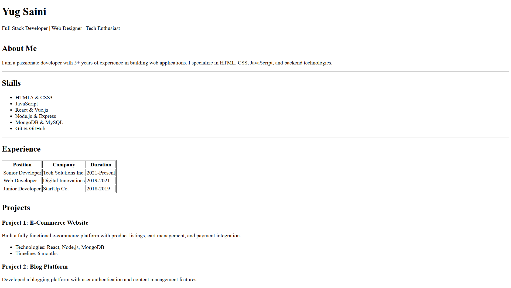

# Assignment HTML-Resume

---

## 

This assignment helps me understand the HTML tags such as:

- heading (h1,h2,h3..)
- main, section, footer
- ul, li
- table, thead, tbody, tr, th, td
- also HTML character entity (&copy;) copyright symbol

---
